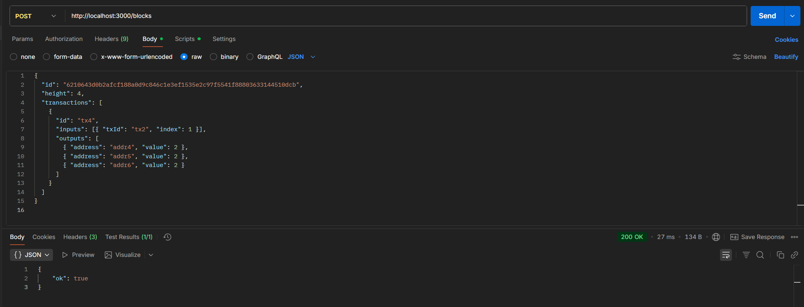
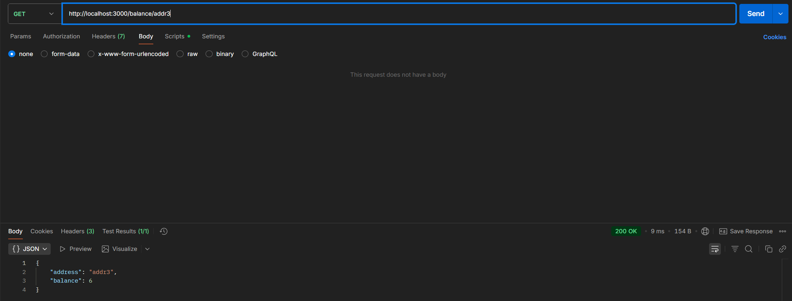
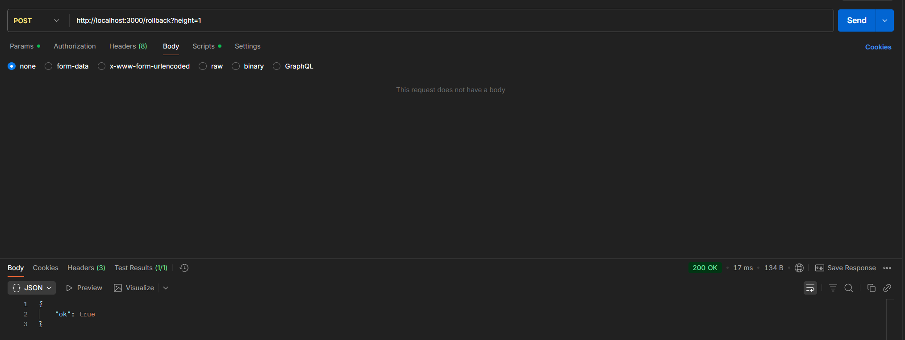

# UTXO Indexer (EMURGO Backend Engineer Challenge)

A simple UTXO-model indexer with a REST API.  
Supports block ingestion, address balance lookup, and rollback to a specified chain height.

---

## Requirements

- **Docker** & **Docker Compose**  
  _(or **Bun** if you prefer running locally without containers)_
- **Postgres** _(started automatically via Docker Compose)_

---

## Quick Start (Docker)

```bash
# Launch API and database
docker compose up -d --build

# Follow API logs
docker compose logs -f api
```

## Project structure

```bash
├── src/
│   ├── index.ts                # route registration and server launch
│   ├── types.ts                # types Block/Tx/Input/Output
│   └── db.ts                   # shared Pool and transactional helper runTx
├── routes/
│   ├── balance.ts              # GET /balance/:address
│   ├── blocks.ts               # POST /blocks (call validation + transaction)
│   └── rollback.ts             # POST /rollback?height=N
├── services/
│   ├── blockValidator.ts       # validateShape, validateBlockId
│   ├── blockApplier.ts         # use of the block in the database (UTXO, balances, height)
│   └── rollbackApplier.ts      # state rollback to a specified height
│
│ #Tests
│
└── spec/
    ├── testUtils.ts            # utilities: resetDb, post/get, sha256, etc.
    ├── api.happy.spec.ts       # positive scenario + rollback
    └── api.negatives.spec.ts   # negative cases (errors/validation)

```

## API

### POST /blocks

Accepts block:

```bash
type Output = { address: string; value: number };
type Input = { txId: string; index: number };
type Tx = { id: string; inputs: Input[]; outputs: Output[] };
type Block = { id: string; height: number; transactions: Tx[] };
```

Validated:

- Height strictly `current_height + 1 (first block — 1)`;
- `Block.id = sha256(String(height) + tx1.id + tx2.id + ... + txN.id)`;
- The sum of inputs equals the sum of outputs (there are no coinbase inputs);
- Inputs exist, are not spent, and are not double-spent within the block.
- Success:

```bash
200 {“ok”: true}.
```

- Validation errors:

```bash
400 {“error”: “<message>”}.
```

**_First step:_**

```bash
{
  "id": "d1582b9e2cac15e170c39ef2e85855ffd7e6a820550a8ca16a2f016d366503dc",
  "height": 1,
  "transactions": [
    {
      "id": "tx1",
      "inputs": [],
      "outputs": [{ "address": "addr1", "value": 10 }]
    }
  ]
}
```

**Checking balance:**

- GET /balance/addr1 → `{“address”:‘addr1’,“balance”:10}`
- GET /balance/addr2 → 0
- GET /balance/addr3 → 0

**_Second step:_**

```bash
{
  "id": "c4701d0bfd7179e1db6e33e947e6c718bbc4a1ae927300cd1e3bda91a930cba5",
  "height": 2,
  "transactions": [
    {
      "id": "tx2",
      "inputs": [{ "txId": "tx1", "index": 0 }],
      "outputs": [
        { "address": "addr2", "value": 4 },
        { "address": "addr3", "value": 6 }
      ]
    }
  ]
}
```

**Checking balance:**

- GET /balance/addr1 → 0
- GET /balance/addr2 → 4
- GET /balance/addr3 → 6

**_Third step:_**

```bash
{
  "id": "4e5f22a2abacfaf2dcaaeb1652aec4eb65028d0f831fa435e6b1ee931c6799ec",
  "height": 3,
  "transactions": [
    {
      "id": "tx3",
      "inputs": [],
      "outputs": [{ "address": "addr1", "value": 5 }]
    }
  ]
}
```

**Checking balance:**

- GET /balance/addr1 → 5
- GET /balance/addr2 → 4
- GET /balance/addr3 → 6



### GET /balance/:address

Returns the current balance of the address:

```bash
{ "address": "addr1", "balance": 10 }
```



### POST /rollback?height=number

- Rolls back the indexer state to height.
- Blocks `(current_height ... height+1)` are rolled back in reverse order:
- Outputs created by transactions are deleted (and balance accruals are reduced);
- Input outputs are “spent” (`spent_at_tx` is reset to zero, the owner's balance is increased);
- Transactions and blocks records are deleted;
- `meta.current_height` is updated.
  Limitations:
- It is not possible to roll back into the “future” (beyond the current height);
- The rollback depth is limited to no more than 2000 blocks.
- Success:

```bash
200 {“ok”: true}.
```

- Validation errors:

```bash
400 {“error”: “<message>”}.
```


